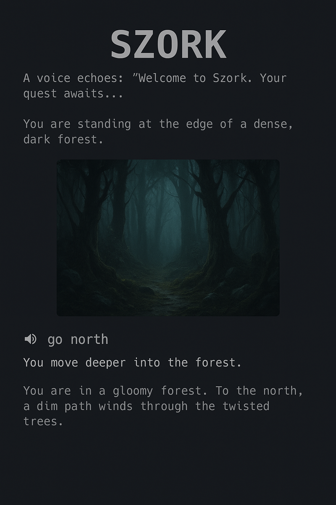

# Szork 🧙‍♂️🎙️
**Szork** is a voice-controlled, Zork-style text adventure game demo built using [LLM4S](https://github.com/llm4s/llm4s) — a Scala toolkit for integrating large language models with real-world tools.
It showcases an LLM agent acting as a **Dungeon Master**, allowing players to explore a fantasy world using natural language input.

## 🎮 Preview


## 📢 About
This project was created as part of the **"Scala Meets GenAI: Build the Cool Stuff with LLM4S"** talk:
- 🗓 **August 21, 2025**  
- 🎤 **Scala Days 2025**  
- 📍 **SwissTech Convention Center**, EPFL campus, Lausanne, Switzerland 🇨🇭  
- 🔗 [Talk Details](https://scaladays.org/editions/2025/talks/scala-meets-genai-build-the)  
- 🔗 [LinkedIn Post](https://www.linkedin.com/feed/update/urn:li:activity:7348123421945262080/)

## 🚀 Features
- 🧠 LLM-driven gameplay logic (agent as Dungeon Master)
- 💬 Natural language input
- 🖼 Scene-by-scene narration + AI-generated visuals
- 🧰 Tool calling for inventory, puzzles, and logic

## 🧠 Demo Use Case
A voice-controlled Zork-style adventure game is an excellent demo to showcase LLM4S:

### Perfect Feature Alignment
- **LLM as DM**: Narrative generation & game state tracking  
- **Speech-to-Text**: Voice commands  
- **Text-to-Speech**: Spoken responses  
- **Image Generation**: Scene illustrations  
- **Tool Calling**: Inventory, combat, puzzles  
- **Agentic Workflows**: DM manages flow and reasoning  

### Suggested Flow
1. Title screen with narration via TTS  
2. Scene image is generated  
3. Player speaks a command (e.g. "go north")  
4. Agent processes → updates state → describes outcome  
5. New image + TTS narration  

### Advanced Features
- RAG referencing game lore  
- Complex puzzles using reasoning  
- Dice rolls, state memory, multi-turn logic  

## 🚀 Quick Start - Run the Demo

### Prerequisites
- **Java 17+** (tested with Java 20)
- **Node.js & npm** (Node.js ^20.19.0 || >=22.12.0 recommended)  
- **sbt 1.7+** (Scala build tool)

### Step 1: Get the Code
```bash
git clone https://github.com/llm4s/llm4s.git
cd llm4s
git fetch origin
git checkout szork
```

### Step 2: Start Frontend (Terminal 1)
```bash
cd szork/frontend
npm install
npm run dev
```
✅ **Frontend running**: http://localhost:3000

### Step 3: Start Backend (Terminal 2)  
```bash
# From llm4s root directory
sbt "szork/runMain org.llm4s.szork.SzorkSimpleServer"
```
✅ **Backend running**: http://localhost:8080

### Step 4: Play the Demo
Open your browser and go to: **http://localhost:3000**

## ⚡ Troubleshooting

### Backend Won't Start
**Missing dependencies error?**
```bash
git pull origin szork  # Get latest fixes
sbt reload             # Reload build configuration
```

**Server starts but exits immediately?**
```bash
git pull origin szork  # Get latest "Fix running from sbt" commit
```

### Test Backend is Running
```bash
curl http://localhost:8080              # Basic connectivity
curl http://localhost:8080/api/health   # Health check
curl -X POST http://localhost:8080/api/game/start  # Game endpoint
```

### Node.js Warnings
If you see Node version warnings, the demo will still work, but consider updating Node.js for the best experience.

## 🔧 Technical Details

### Architecture
- **Frontend**: React + TypeScript + Vite (port 3000)
- **Backend**: Scala + Cask web framework (port 8080)  
- **Development**: Modular setup within LLM4S for co-development

### API Endpoints
- `POST /api/game/start` - Start new game session
- `POST /api/game/command` - Send player command  
- `GET /api/health` - Server health check

### Development Notes
- Current demo: Simplified version for testing (without full LLM integration)
- Hot reloading: Both frontend and backend support live updates
- Co-development: Changes to LLM4S and Szork developed together

### Maintainers
Want to connect with maintainers? The Szork project is maintained by:
- **Rory Graves** - [https://www.linkedin.com/in/roryjgraves/](https://www.linkedin.com/in/roryjgraves/) | Email: [rory.graves@fieldmark.co.uk](mailto:rory.graves@fieldmark.co.uk) | Discord: `rorybot1`
- **Kannupriya Kalra** - [https://www.linkedin.com/in/kannupriyakalra/](https://www.linkedin.com/in/kannupriyakalra/) | Email: [kannupriyakalra@gmail.com](mailto:kannupriyakalra@gmail.com) | Discord: `kannupriyakalra_46520`

## License
This project is licensed under the Apache License 2.0 - see the [LICENSE](LICENSE) file for details.

----------------
[llm4s]: https://github.com/llm4s/llm4s  
[Scala 3]: https://dotty.epfl.ch/  
[Scala 2]: https://www.scala-lang.org/
