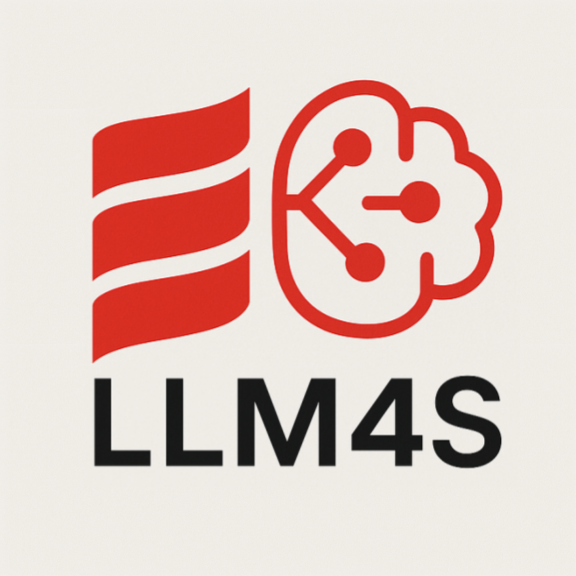
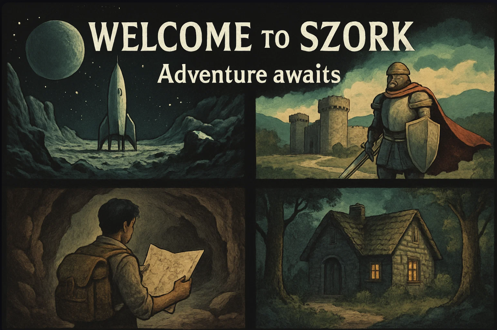
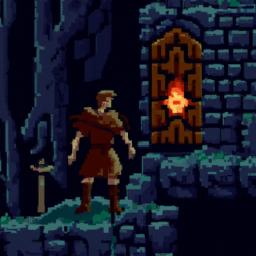
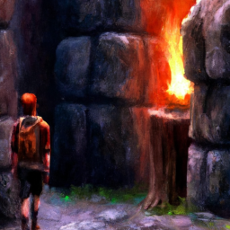
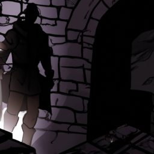
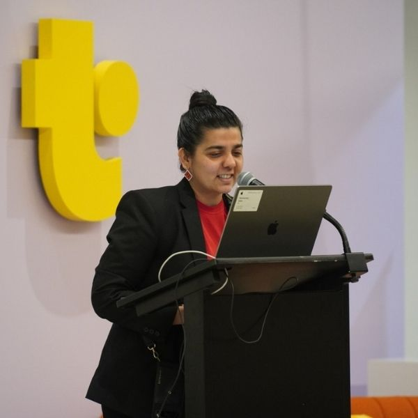

<!-- Slide 1: Title Slide -->
# Build the Cool Stuff with LLM4S
**Page Layout:** title

**Visual Specification:**
- Logo:  (bottom center)

**Content:**
## Build the Cool Stuff with LLM4S

**Presenters:** Rory Graves & Kannupriya Kalra
**Event:** London Scala User Group | August 13th, 2024

**Speaker Notes:**

Instead of starting with introductions, we're going to jump right in. Can you build the coolest GenAI apps in Scala? Let's find out with a game!

---

<!-- Slide 2: Let's Play a Game! -->
# Let's Play SZork!
**Page Layout:** full-screen

**Visual Specification:**
- Background: 
- Overlay: Semi-transparent dark panel at bottom with text
- Font: Retro gaming font for "SZork" title

**Content:**
## 100% Scala-Powered AI Adventure

### Features:
- Real-time story generation
- Dynamic image creation
- Adaptive music
- Voice input support

**Speaker Notes:**
This is SZork - a fully AI-powered text adventure game. Everything you're about to see - the story, the images, the music - is generated in real-time by AI, orchestrated entirely through Scala and LLM4S.

---

<!-- Slide 3: Choose Your Adventure -->
# VOTE NOW: What kind of adventure?
**Page Layout:** grid-2x2

**Visual Specification:**
- Background: #1a1a1a with grid layout
- Eight theme cards with icons
- Voting prompt at top

**Content:**
| Classic Fantasy | Sci-Fi Space |
|----------------|--------------|
| 🏰 Dungeons & Dragons style | 🚀 Space exploration |

| Mystery Mansion | Underwater |
|----------------|------------|
| 🕵️ Detective story | 🌊 Ocean depths |

| Post-Apocalyptic | Time Travel |
|-----------------|------------|
| ☢️ Survival | ⏰ Historical |

| Cyberpunk | Wild West |
|-----------|-----------|
| 🌃 Neo-noir | 🤠 Frontier |

**Speaker Notes:**
Let's make this interactive! Show of hands - which adventure theme should we play? [Count votes] Great, looks like [winner] wins!

---

<!-- Slide 4: Choose Your Art Style -->
# VOTE: Pick the art style!
**Page Layout:** split-screen

**Visual Specification:**
- Four art style samples displayed
- Each labeled clearly
- Visual comparison side-by-side

**Content:**
| Pixel Art | Illustration |
|-----------|-------------|
|  |  |

| Oil Painting | Comic Book |
|--------------|------------|
|  |  |

**Speaker Notes:**
And now for the visual style - which one appeals to you? [Take vote] Perfect! Let's start the game with [chosen theme] in [chosen style].

---

<!-- Slide 5: The Magic Behind the Scenes -->
# AI Services Orchestra
**Page Layout:** network-diagram

**Visual Specification:**
- Central node: LLM4S/Scala logo
- Radiating connections to AI services
- Service logos at endpoints
- Real-time indicator badges

**Content:**
## Real-Time Integration:
```
LLM4S (Scala) ─┬─→ OpenAI GPT-4 (Story)
               ├─→ DALL-E 3 (Images)
               ├─→ Whisper (Speech-to-Text)
               ├─→ TTS (Narration)
               └─→ Suno AI (Music)
```

### API Calls Per Turn:
- Story generation: 2-3 calls
- Image creation: 1 call
- Music generation: 1 call
- Total latency: ~5-8 seconds

**Speaker Notes:**
[Open browser dev tools] Look at this - every aspect is powered by different AI services, all orchestrated through LLM4S. No Python, no JavaScript AI libraries - pure Scala managing this complex multi-modal experience.

---

<!-- Slide 6: Who We Are -->
# Meet the Founders
**Page Layout:** split-screen

**Visual Specification:**
- Two professional headshots side by side
- Names and titles below
- Brief bio points for each
- LLM4S timeline at bottom

**Content:**
| Rory Graves | Kannupriya Kalra |
|-------------|------------------|
|  |  |
| **Co-founder & CTO** | **Co-founder & CEO** |
| • 30+ years building tools | • GSoC admin Scala Center |
| • Scala compiler contributor | • 10+ years functional programming |
| • AI/ML research & mentorship | • International speaker |

### Our Journey:
- 2021: Project inception
- 2022: Open source release
- 2023: Google Summer of Code
- 2024: Production ready

**Speaker Notes:**
We're both original founders of LLM4S. We built it because we needed GenAI in our production Scala systems, and Python wasn't cutting it for enterprise scale.

---

<!-- Slide 7: The LLM4S Story -->
# Why We Built LLM4S
**Page Layout:** timeline

**Visual Specification:**
- Horizontal timeline spanning slide width
- Key milestones marked with icons
- Growth metrics below timeline

**Content:**
## The Problem:
- 🐍 Python dominance in AI/ML
- 📊 Enterprise needs type safety
- ⚡ Production requirements
- 🔧 Integration challenges

## The Solution:
- ✅ Pure Scala implementation
- ✅ Type-safe AI operations
- ✅ Production-ready features
- ✅ Seamless JVM integration

**Growth:** 98 ⭐ | 15+ Contributors

**Speaker Notes:**
We needed GenAI in our production Scala systems. Python libraries were great for prototypes but lacked the type safety and JVM integration we needed at scale.

---

<!-- Slide 8: Google Summer of Code Impact -->
# Community-Driven Development
**Page Layout:** content-with-sidebar

**Visual Specification:**
- Main content: GSoC contributions
- Sidebar: Community growth metrics
- GSoC logo placement

**Content:**
## GSoC 2023 Contributions:
- 📚 Embedding support system
- 🔌 MCP (Model Context Protocol) integration
- 🧪 Enhanced testing framework
- 📖 Comprehensive documentation
- 🎯 New sample applications

### Community Growth:
- Students: 5 GSoC participants
- New features: 12 major additions
- Code contributions: 2,500+ commits
- Documentation: 100+ pages

**Speaker Notes:**
Google Summer of Code transformed LLM4S from a useful tool to a comprehensive framework. Students added embedding support, MCP integration, and much more.

---

<!-- Slide 9: Image Understanding Demo -->
# Beyond Generation: Image Understanding
**Page Layout:** comparison

**Visual Specification:**
- Left: Input image/screenshot
- Right: AI analysis output
- Code snippet at bottom

**Content:**
## Input: Screenshot or uploaded image
## Output: Structured analysis

```scala
val analysis = client.analyzeImage(
  imageFile = "screenshot.png",
  prompt = "Describe this UI and suggest improvements"
)
// Returns detailed component analysis
```

### Use Cases:
- 📱 UI/UX analysis
- 🔍 Document processing
- ♿ Accessibility checking
- 🛡️ Content moderation

**Speaker Notes:**
Not just generation - understanding too. Upload any image and get structured analysis. Perfect for automated testing, documentation, or accessibility compliance.

---

<!-- Slide 10: Agent Architecture -->
# Immutable Agent State Management
**Page Layout:** content-with-sidebar

**Visual Specification:**
- Main: Code example
- Sidebar: State diagram
- Flow arrows showing progression

**Content:**
```scala
{code:examples/scala/agent-state.scala:1-20}
```

### State Flow:
1. Initialize with query
2. Add to conversation history
3. Call LLM with context
4. Process tool calls
5. Update immutable state
6. Return new state

**Speaker Notes:**
Back to SZork - how does the game agent work? It's all about immutable state management. Every action creates a new state, maintaining complete history.

---

<!-- Slide 11: Tool Calling System -->
# Extensible Tool System
**Page Layout:** split-screen

**Visual Specification:**
- Left: Tool definition code
- Right: Execution flow diagram

**Content:**
```scala
{code:examples/scala/tool-calling.scala:1-15}
```

### Available Tools:
- Weather API
- Database queries
- File operations
- Web scraping
- Custom functions

**SZork Tools:** Image generation, music creation, state persistence

**Speaker Notes:**
Agents can call any tool you define. SZork uses tools for image generation, music creation, and game state management. You can add any tool with a simple trait implementation.

---

<!-- Slide 12: Document Processing -->
# PDF & Document Intelligence
**Page Layout:** content-with-sidebar

**Visual Specification:**
- Main: PDF processing demo
- Sidebar: Capabilities list

**Content:**
```scala
val summary = DocumentProcessor
  .fromPDF("report.pdf")
  .summarize(maxTokens = 500)
  
val searchResults = semanticSearch(
  documents = loadedDocs,
  query = "performance metrics"
)
```

### Capabilities:
- 📄 PDF extraction & summarization
- 🔍 Semantic search
- 📊 Structured data extraction
- 🌐 Multi-language support

**Speaker Notes:**
Same agent pattern, different tools. Process PDFs, extract structured data, perform semantic search - all with type-safe Scala code.

---

<!-- Slide 13: Why Scala? -->
# The Power of Type Safety
**Page Layout:** comparison

**Visual Specification:**
- Side-by-side code comparison
- Type safety highlights
- Performance metrics

**Content:**
## Scala:
```scala
def generateStory(theme: Theme, style: ArtStyle): Either[LLMError, Story] = 
  // Compile-time safety
```

## Python:
```python
def generate_story(theme, style):
    # Runtime errors possible
```

### Benefits:
- ✅ Compile-time error prevention
- ✅ Immutable data structures
- ✅ Concurrent processing
- ✅ JVM ecosystem access

**Performance:** 45ms response time

**Speaker Notes:**
Why Scala matters - type safety prevents runtime errors that plague Python implementations. Plus immutability and JVM performance at scale.

---

<!-- Slide 14: What You Can Build -->
# Complete AI Toolkit
**Page Layout:** grid-3x3

**Visual Specification:**
- Nine capability cards
- Icons for each use case
- Check marks showing coverage

**Content:**
| Conversational AI | RAG Systems | Code Generation |
|------------------|-------------|-----------------|
| ✅ Multi-turn agents | ✅ Custom datasets | ✅ Automated coding |

| Image AI | Document AI | Search |
|----------|------------|--------|
| ✅ Generation & understanding | ✅ PDF processing | ✅ Semantic search |

| Tool Agents | Workflows | Content |
|-------------|-----------|---------|
| ✅ Custom tools | ✅ Multi-step | ✅ Generation |

**All demonstrated today in SZork!**

**Speaker Notes:**
Everything on this list - we've shown you today through SZork and our demos. This is a complete toolkit for building AI applications in Scala.

---

<!-- Slide 15: Production Features -->
# Enterprise-Ready
**Page Layout:** content-with-sidebar

**Visual Specification:**
- Main: Feature list with icons
- Sidebar: Architecture diagram

**Content:**
## Multi-Provider Support:
- OpenAI, Anthropic, Cohere
- Local models (Ollama)
- Switch with one line

## Observability:
- Langfuse integration
- Distributed tracing
- Cost tracking

## Reliability:
- Either[Error, Success] pattern
- Retry mechanisms
- Graceful degradation

**Scale:** 10+ production deployments

**Speaker Notes:**
This isn't just for demos - LLM4S is battle-tested in production. Multi-provider support, observability, error handling - everything you need for enterprise deployment.

---

<!-- Slide 16: Community & Ecosystem -->
# Join the Movement
**Page Layout:** content-with-sidebar

**Visual Specification:**
- Community metrics display
- Logos of contributing organizations
- Growth chart

**Content:**
## Community Stats:
- GitHub: 98 ⭐
- Contributors: 15+
- Discord members: 500+
- Monthly downloads: 10K+

## Ecosystem:
- Google Summer of Code
- Corporate contributors
- Academic research
- Open source plugins

### Get Involved:
- 💬 Discord: https://discord.gg/llm4s
- 🐙 GitHub: https://github.com/llm4s/llm4s
- 📚 Docs: https://docs.llm4s.io

**Speaker Notes:**
We're not alone - there's a growing community building amazing things with LLM4S. From GSoC students to enterprise teams, everyone's contributing.

---

<!-- Slide 17: Getting Started -->
# Start Building Today
**Page Layout:** split-screen

**Visual Specification:**
- Left: build.sbt configuration
- Right: Simple example code

**Content:**
## Add to build.sbt:
```scala
libraryDependencies += 
  "com.llm4s" %% "llm4s-core" % "0.5.0"
```

## Your First Agent:
```scala
{code:examples/scala/quickstart.scala}
```

### Resources:
- 📁 Samples folder
- 🎮 SZork source code
- 📖 Documentation
- 💬 Discord support

**Speaker Notes:**
Getting started is simple - add one dependency, write a few lines of code. Check out the samples folder, explore SZork source, join our Discord for help.

---

<!-- Slide 18: Call to Action -->
# You Can Build the Cool Stuff!
**Page Layout:** title-subtitle

**Visual Specification:**
- Large, bold call to action
- QR codes for GitHub/Discord
- Contact information

**Content:**
## Start Today:
- 🌟 Star us on GitHub: https://github.com/llm4s/llm4s
- 💬 Join Discord: https://discord.gg/llm4s
- 🤝 Contribute: We're looking for contributors!
- 📧 Contact: rory@llm4s.io | kannupriya@llm4s.io

### Coming Soon:
- Advanced RAG implementation
- Streaming responses
- More model providers
- Enhanced MCP support

**Speaker Notes:**
You can build the cool stuff! Everything you saw today is open source. Star the repo, join our Discord, contribute code. Let's build the future of Scala + AI together.

---

<!-- Slide 19: Thank You -->
# Thank You!
**Page Layout:** title

**Visual Specification:**
- Clean, minimal design
- Contact information prominent
- Social media handles

**Content:**
## Questions?

### Rory Graves
- 🐦 @a_dev_musing
- 💼 linkedin.com/in/roryjgraves

### Kannupriya Kalra
- 🐦 @KannupriyaKalra
- 💼 linkedin.com/in/kannupriyakalra

**Project:** github.com/llm4s/llm4s

**Speaker Notes:**
Thank you for joining us today! We have a few minutes for questions. Both of us are here to answer anything about LLM4S, SZork, or building AI applications in Scala.

---

<!-- Slide 20: Q&A -->
# Q&A
**Page Layout:** full-screen

**Visual Specification:**
- Background: Gradient with LLM4S logo
- Large "Q&A" text
- Prepared questions listed

**Content:**
## Prepared Topics:
- How does performance compare to Python?
- Can it work with local models?
- What about streaming responses?
- Rate limiting strategies?
- RAG implementation details?
- Production deployment tips?
- Contributing to LLM4S?

**Speaker Notes:**
[Prepared backup questions if needed]
- "How does RAG performance compare to vector DBs?" - We support multiple backends...
- "Can it work with Llama?" - Yes, through Ollama integration...
- "Performance vs Python?" - JVM advantages at scale...